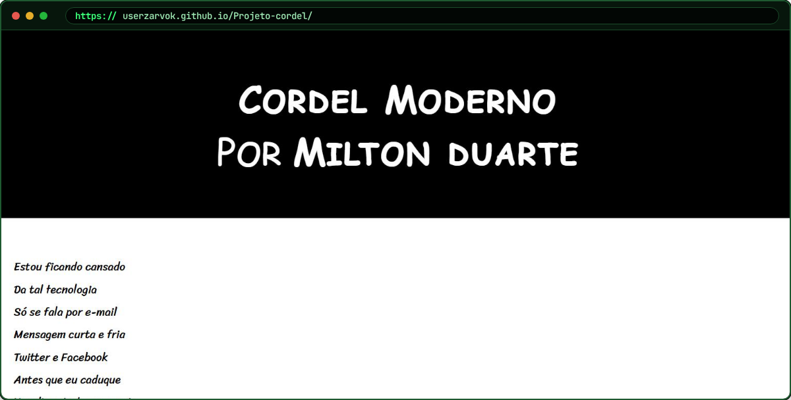

<div align="center">



<br>

<a href="https://userzarvok.github.io/Projeto-cordel/"></a>


</div>

**Cordel Moderno** é uma página que apresenta o poema de mesmo nome, de **Milton Duarte**, no clima da literatura de
cordel: estrofes em sequência, letras desenhadas à mão e imagens de fundo que ficam paradas enquanto o texto rola.

<a href="https://userzarvok.github.io/Projeto-cordel/"></a>

## O que usei

- HTML com `header`, `section` e `footer`;
- fonte do **Google Fonts** (Sriracha) importada no CSS, com as famílias de fonte guardadas em **variáveis CSS**;
- título em `small-caps` com `text-shadow`;
- **imagens de fundo fixas** (`background-attachment: fixed`) que dão o efeito de profundidade ao rolar.

## Estrutura

```text
Projeto-cordel/
├── index.html
├── style.css
└── imagens/   fundos das seções
```

## Créditos

Poema *Cordel Moderno*, de Milton Duarte, usado para estudo; os direitos do poema pertencem ao autor.

## Licença

© 2026 Pedro ([@Userzarvok](https://github.com/Userzarvok)). **Todos os direitos reservados**: você pode ver o código e o
site para estudar, mas não pode copiar nem publicar em outro lugar sem autorização. Veja o arquivo [LICENSE](LICENSE).
